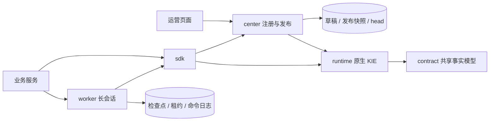

# 架构与原生能力

中台管理业务接入和规则发布，不重新实现规则求值。共享 `drools.runtime` 直接使用 Drools/KIE；表单生成的 DRL 与上传的原生资产进入相同发布链路。

模块依赖方向：runtime → contract；sdk → runtime；center → runtime；worker → sdk。中心不依赖 Worker，公共运行时不依赖业务 DAO 或控制器。注册服务处理配置，发布服务处理完整快照，运行注册表只读取已提交 head。接口层负责请求映射与权限，不承载注册流程。

## 发布一致性

发布串行锁定规则类型行，校验草稿版本、规则版本和当前发布修订，编译整个类型资源包，写不可变快照、审计操作者和发布 head。数据库提交前不切换内存。执行按 head 获取引用计数运行代；旧代在最后一个在途请求结束后释放。长会话固定自己的发布快照，不把不同版本事实直接混入新规则。

冻结范围：原始规则内容、多资源配置、单据对象及字段、返回树、event mode、kmodule、POM。Maven 规则包在发布时归档实际 KJAR 及 KIE 依赖。普通 Java 依赖仍需要各节点一致的部署 classpath 和不可覆盖的 Maven 仓库；不能依赖可变 SNAPSHOT 的普通 Java 库获得可复现发布。

## 能力矩阵

| 原生能力 | 中台入口 | 验证边界 |
| --- | --- | --- |
| DRL、MVEL、声明事实、函数、查询、TMS | 原生资源包、SDK KieSession | 跨文件、query、逻辑插入与包内 Java 类编译回归 |
| accumulate/collect/from、agenda/ruleflow group、salience、属性和 OOPath | DRL 原文、原生 KIE API | 不做模板改写；并未逐个组合穷举测试 |
| DSL/DSLR | resources | 编译与点火测试 |
| Excel/CSV 决策表 | resources，DTABLE 配置 | Excel/CSV 编译与执行测试 |
| DMN/FEEL | /rule/dmn/evaluate、SDK runtime | DMN 决策执行测试 |
| PMML | /rule/pmml/evaluate、SDK runtime | 回归模型执行测试；模型种类由 7.73 原生实现决定 |
| KJAR/Maven、kmodule、executable model | 资源发布、SDK KieContainer | KJAR、命名 base、executable model 测试 |
| Stateful/stateless/named session、session pool | SDK retainRuntime().container() | 保留原生 API，调用方管理子对象生命周期 |
| CEP、entry point、pseudo/realtime clock、timer、calendar、fireUntilHalt | SDK、Worker | named entry point 更新/删除、恢复、时钟及 active 模式测试 |
| Listener、live query、任意 Java 事实、command、rule unit | SDK 原生对象 | 原生 API，不强行映射为 JSON |
| Environment、JPA/JTA persistence、自定义 marshalling | RuleRuntimeOptions/NativeSessionFactory | JDBC checkpoint 已验证；JPA/JTA 部署由业务配置 |
| Scanner | SDK container + KieServices | 可使用 native scanner；生产快照不由 scanner 自动改写 |

“保持原生能力”与“每项都经过中台生产验证”是不同结论。没有自制受限执行器，也没有声称所有 KIE 插件已内置。需要额外 assembler/业务 jar 时按原生方式加入 runtime 或业务 classpath。

Drools 是可信代码执行环境，DRL consequence、MVEL、Java 类可能访问进程能力。作者权限不是沙箱。跨租户不可信规则需要隔离 Worker 进程、数据库账号、网络与资源配额，不能靠规则语法阉割替代隔离。

官方参考：[KIE 构建与运行](https://docs.drools.org/latest/drools-docs/drools/KIE/index.html)、[DMN](https://docs.drools.org/latest/drools-docs/drools/DMN/index.html)。保留 7.73 兼容基线，上述最新页面的新增能力不能直接视为本项目已支持。
